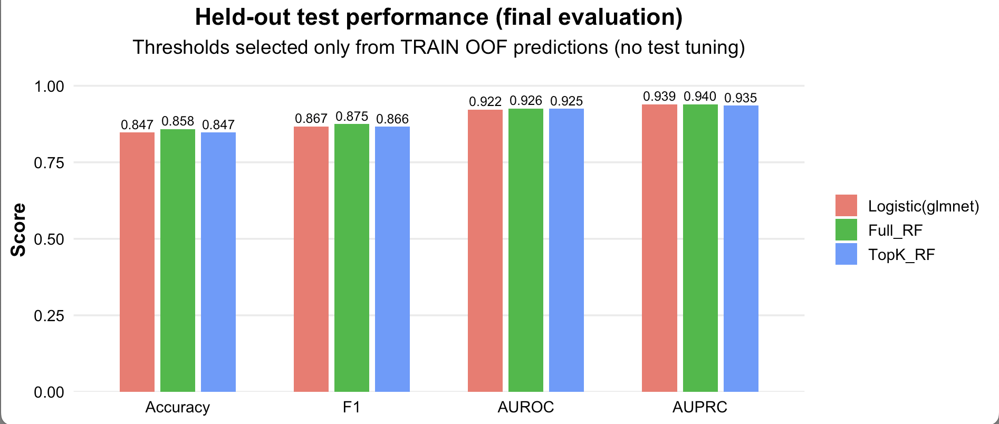

# heartPredictionR – Heart Disease Risk Prediction with Machine Learning

## Overview

heartPredictionR provides a reproducible interface for predicting heart disease risk from routine clinical features using a pre-trained machine learning model bundle shipped with the package.

Disclaimer: This R package is for educational and research purposes only and must not be used for real clinical decision making.

The package is designed for deployment-style usage:
	- a pre-trained bundle (.rds) is loaded from inst/extdata/
	- users call high-level predict functions on new data
	- the same prediction logic can be reused in a Shiny application or other R workflows


## Dataset

The package is built around the Kaggle dataset Heart Failure Prediction (September 2021), curated by combining five classic heart disease datasets under 11 common predictors.
	- Dataset URL: https://www.kaggle.com/datasets/fedesoriano/heart-failure-prediction/data
	- Samples: 918
	- Predictors: 11 clinical features
	- Target: HeartDisease (binary)

Target definition (class labels used by this package):
	- Presence – heart disease present (positive class)
	- Absence – heart disease absent (negative class)

Main predictors:
	- Age (years)
	- Sex (M/F)
	- ChestPainType (TA/ATA/NAP/ASY)
	- RestingBP (mm Hg)
	- Cholesterol (mg/dl)
	- FastingBS (0/1)
	- RestingECG (Normal/ST/LVH)
	- MaxHR (60–202)
	- ExerciseAngina (Y/N)
	- Oldpeak (ST depression)
	- ST_Slope (Up/Flat/Down)


## Installation

You can install the package from GitHub with either remotes or devtools.

```r
# Use remotes
install.packages("remotes")
remotes::install_github("tian233-bot/heartPredictionR")
```

``` r
# Or use devtools
install.packages("devtools")
devtools::install_github("tian233-bot/heartPredictionR")
```
If download fails (network / RStudio downloader issues)

On some networks, RStudio’s default downloader may fail to fetch the GitHub tarball.
In that case, switch to curl and try again:
```r
options(download.file.method = "curl")
remotes::install_github("tian233-bot/heartPredictionR", upgrade = "never", force = TRUE)
```

Then load the package:

```r
library(heartPredictionR)
```
System requirements: R (>= 4.1.0 recommended)
Imported packages are listed in DESCRIPTION.


# Quick Start (Prediction Workflow)

## 1. Load the bundled model
```r
library(heartPredictionR)

# Check the bundle file exists inside the installed package
system.file("extdata", "heart_models_RECIPES_STRICT_bundle.rds", package = "heartPredictionR")

b <- heart_load_bundle()
names(b)
```
## 2. Choose a safe default model

This package may ship multiple models (TopK RF / Full RF / Logistic).
The code below prefers TopK when available, otherwise falls back to Full RF, then Logistic.
```r
pick_model <- function(b) {
  if (!is.null(b$rf_top_cv)) return("topk")
  if (!is.null(b$rf_full_cv)) return("full")
  "logistic"
}

model <- pick_model(b)
model
```
## 3. Predict one patient (class label)

heart_predict() returns the class label (coursework-style output).
```r
new_pat <- data.frame(
  Age=54, Sex="M", ChestPainType="ATA", RestingBP=140, Cholesterol=289, FastingBS="0",
  RestingECG="Normal", MaxHR=172, ExerciseAngina="N", Oldpeak=0.0, ST_Slope="Up"
)

heart_predict(new_pat, bundle = b, model = model)
```
## 4. Predict probability of Presence

heart_predict_proba() returns the predicted probability of the positive class.
```r
heart_predict_proba(new_pat, bundle = b, model = model)
```
## 5. Batch prediction (multiple rows)
```r
new_patients <- data.frame(
  Age=c(54, 63),
  Sex=c("M","F"),
  ChestPainType=c("ATA","NAP"),
  RestingBP=c(140, 120),
  Cholesterol=c(289, 250),
  FastingBS=c("0","1"),
  RestingECG=c("Normal","ST"),
  MaxHR=c(172, 132),
  ExerciseAngina=c("N","Y"),
  Oldpeak=c(0.0, 2.3),
  ST_Slope=c("Up","Flat")
)

heart_predict(new_patients, bundle = b, model = model)
heart_predict_proba(new_patients, bundle = b, model = model)
```


# Example Data Shipped with the Package

This package includes the original dataset CSV for testing:
```r
library(heartPredictionR)

csv_path <- system.file("extdata", "heart3.csv", package = "heartPredictionR")
raw <- read.csv(csv_path)

# Keep the 11 required predictors (drop the label if present)
x <- raw[, c("Age","Sex","ChestPainType","RestingBP","Cholesterol",
             "FastingBS","RestingECG","MaxHR","ExerciseAngina","Oldpeak","ST_Slope")]

b <- heart_load_bundle()
model <- if (!is.null(b$rf_top_cv)) "topk" else "full"

head(heart_predict_proba(x[1:5, ], bundle = b, model = model))
```
# Input Schema

Required columns (prediction-time schema):
	- Age (numeric)
	- Sex (categorical)
	- ChestPainType (categorical)
	- RestingBP (numeric)
	- Cholesterol (numeric)
	- FastingBS (categorical)
	- RestingECG (categorical)
	- MaxHR (numeric)
	- ExerciseAngina (categorical)
	- Oldpeak (numeric)
	- ST_Slope (categorical)

The package may automatically add engineered features for robustness (depending on the shipped bundle / pipeline):
	- age_decade
	- high_bp_flag
	- high_chol_flag

# Model Bundle and Reproducibility

The package ships with a pre-trained model bundle (`.rds`) and loads it at runtime via `heart_load_bundle()`.

Bundle location inside the installed package:

```r
system.file("extdata", "heart_models_RECIPES_STRICT_bundle.rds", package = "heartPredictionR")
```
The bundle stores:
	- trained model objects (TopK RF / Full RF / Logistic, depending on training output)
	- required input schema (required_cols, factor_levels)
	- recommended thresholds (OOF-derived)
	- optional evaluation tables if included during training

# Model Performance

The figure below summarises test-set performance of three classifiers (Logistic, Full RF, TopK RF), including Accuracy/AUROC/AUPRC and ROC/PR curves.



# Model Evaluation+Calibration(Reproducible Example)

This section demonstrates evaluation using the packaged CSV (for reproducibility).
If your bundle also contains a held-out test split, you can use it directly; otherwise you can evaluate on the full dataset for demonstration.
```r
library(heartPredictionR)

b <- heart_load_bundle()
model <- if (!is.null(b$rf_top_cv)) "topk" else "full"

csv_path <- system.file("extdata", "heart3.csv", package = "heartPredictionR")
raw <- read.csv(csv_path)

y <- raw$HeartDisease
x <- raw[, c("Age","Sex","ChestPainType","RestingBP","Cholesterol",
             "FastingBS","RestingECG","MaxHR","ExerciseAngina","Oldpeak","ST_Slope")]

prob <- heart_predict_proba(x, bundle = b, model = model)

# pick the matching stored threshold if available
thr <- if (model == "topk") (b$thr_top %||% 0.5) else if (model == "full") (b$thr_full %||% 0.5) else (b$thr_glm %||% 0.5)

ev <- heart_eval_threshold(
  y_true = y,
  prob_pos = prob,
  threshold = thr,
  positive_level = b$positive_level %||% "Presence"
)
ev

# Calibration bins + ECE
  cal <- heart_calibration(
  y_true = y,
  prob_pos = prob,
  positive_level = b$positive_level %||% "Presence",
  bins = 10
)

cal$ece
head(cal$cal_df)
```
Optional ROC / PR curves (only if you have these packages installed):
```r
if (requireNamespace("pROC", quietly = TRUE)) {
  y_bin <- ifelse(as.character(y) %in% c("1","Presence"), 1, 0)
  roc_obj <- pROC::roc(y_bin, prob, quiet = TRUE)
  pROC::auc(roc_obj)
}

if (requireNamespace("PRROC", quietly = TRUE)) {
  y_bin <- ifelse(as.character(y) %in% c("1","Presence"), 1, 0)
  pr <- PRROC::pr.curve(scores.class0 = prob[y_bin == 1],
                        scores.class1 = prob[y_bin == 0],
                        curve = TRUE)
  pr$auc.integral
}
```

# Model Interpretation 

Permutation feature importance for a Random Forest model (requires vip and a supported fitted model object, e.g. ranger):
```r
library(heartPredictionR)

b <- heart_load_bundle()

if (requireNamespace("vip", quietly = TRUE) && !is.null(b$rf_full_cv)) {
  rf_fit <- b$rf_full_cv
  ranger_model <- rf_fit$finalModel
  if (!is.null(ranger_model)) {
    imp <- heart_importance_rf(ranger_model, top_n = 15)
    heart_plot_importance(imp, title = "Full RF Feature Importance", ylab = "Permutation importance")
  }
}
```


# Shiny Application

A Shiny deployment reusing the same prediction logic is available at:
	- Shiny URL: https://905341291guo.shinyapps.io/heart_prediction/


# URLs
	- Kaggle dataset: https://www.kaggle.com/datasets/fedesoriano/heart-failure-prediction/data
	- Shiny app: https://905341291guo.shinyapps.io/heart_prediction/
	- GitHub repository: https://github.com/tian233-bot/heartPredictionR


# License
MIT + file LICENSE


# Citation

If you use this package in reports or coursework, cite:

heartPredictionR (2025). Heart Disease Risk Prediction with Machine Learning. GitHub: https://github.com/tian233-bot/heartPredictionR


# Contact

Issues and feature requests: https://github.com/tian233-bot/heartPredictionR/issues

