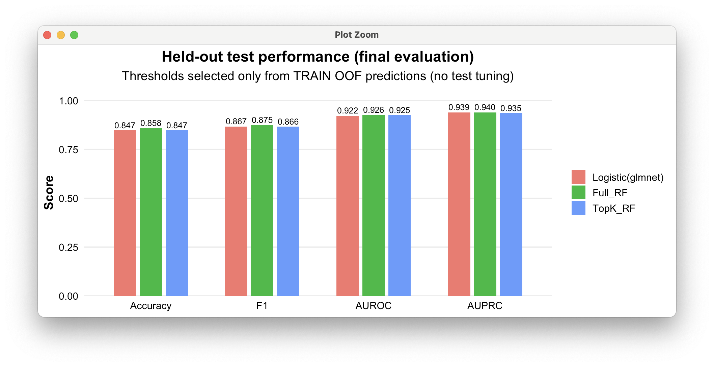

# heartPredictionR – Heart Disease Risk Prediction with Machine Learning

## Overview

heartPredictionR provides a reproducible interface for predicting heart disease risk from routine clinical features using a pre-trained machine learning model bundle shipped with the package.

Disclaimer: This R package is for educational and research purposes only and must not be used for real clinical decision making.

The package is designed for deployment-style usage:
	•	a pre-trained bundle (.rds) is loaded from inst/extdata/
	•	users call high-level predict functions on new data
	•	the same prediction logic can be reused in a Shiny application or other R workflows


## Dataset

The package is built around the Kaggle dataset Heart Failure Prediction (September 2021), curated by combining five classic heart disease datasets under 11 common predictors.
	•	Dataset URL: https://www.kaggle.com/datasets/fedesoriano/heart-failure-prediction/data
	•	Samples: 918
	•	Predictors: 11 clinical features
	•	Target: HeartDisease (binary)

Target definition (class labels used by this package):
	•	Presence – heart disease present (positive class)
	•	Absence – heart disease absent (negative class)

Main predictors:
	•	Age (years)
	•	Sex (M/F)
	•	ChestPainType (TA/ATA/NAP/ASY)
	•	RestingBP (mm Hg)
	•	Cholesterol (mg/dl)
	•	FastingBS (0/1)
	•	RestingECG (Normal/ST/LVH)
	•	MaxHR (60–202)
	•	ExerciseAngina (Y/N)
	•	Oldpeak (ST depression)
	•	ST_Slope (Up/Flat/Down)


## Installation

You can install the package from GitHub with either remotes or devtools.

```r
# Use remotes
install.packages("remotes")
remotes::install_github("tian233-bot/heartPredictionR")
```

``` r
# Or use devtools
install.packages("devtools")
devtools::install_github("tian233-bot/heartPredictionR")
```

Then load the package:

```r
library(heartPredictionR)
```
System requirements: R (>= 4.1.0 recommended)
Imported packages are listed in DESCRIPTION.


# Quick Start (Prediction Workflow)

## 1. Load the bundled model
```r
library(heartPredictionR)

b <- heart_load_bundle()
names(b)
```
## 2. Predict one patient (class label)

heart_predict() returns the class label (coursework-style output).
```r
new_pat <- data.frame(
  Age=54, Sex="M", ChestPainType="ATA", RestingBP=140, Cholesterol=289, FastingBS="0",
  RestingECG="Normal", MaxHR=172, ExerciseAngina="N", Oldpeak=0.0, ST_Slope="Up"
)

heart_predict(new_pat, bundle = b, model = "topk")
```
## 3. Predict probability of Presence

heart_predict_proba() returns the predicted probability of the positive class.
```r
heart_predict_proba(new_pat, bundle = b, model = "topk")
```
## 4. Batch prediction (multiple rows)
```r
new_patients <- data.frame(
  Age=c(54, 63),
  Sex=c("M","F"),
  ChestPainType=c("ATA","NAP"),
  RestingBP=c(140, 120),
  Cholesterol=c(289, 250),
  FastingBS=c("0","1"),
  RestingECG=c("Normal","ST"),
  MaxHR=c(172, 132),
  ExerciseAngina=c("N","Y"),
  Oldpeak=c(0.0, 2.3),
  ST_Slope=c("Up","Flat")
)

heart_predict(new_patients, bundle = b, model = "topk")
heart_predict_proba(new_patients, bundle = b, model = "topk")
```


# Example Data Shipped with the Package

A small CSV template is included under inst/extdata/ for quick testing.
```r
example_path <- system.file("extdata", "heart_example_input.csv", package = "heartPredictionR")
example_df <- read.csv(example_path)

head(example_df)
```
Run predictions:
```
b <- heart_load_bundle()

pred_class <- heart_predict(example_df, b, model = "topk")
table(pred_class)

pred_prob <- heart_predict_proba(example_df, b, model = "topk")
head(pred_prob)
```


# Input Schema

Required columns (prediction-time schema):
	•	Age (numeric)
	•	Sex (categorical)
	•	ChestPainType (categorical)
	•	RestingBP (numeric)
	•	Cholesterol (numeric)
	•	FastingBS (categorical)
	•	RestingECG (categorical)
	•	MaxHR (numeric)
	•	ExerciseAngina (categorical)
	•	Oldpeak (numeric)
	•	ST_Slope (categorical)

The package automatically adds engineered features for robustness:
	•	age_decade
	•	high_bp_flag
	•	high_chol_flag


# Model Bundle and Reproducibility

The package ships with a pre-trained model bundle (`.rds`) and loads it at runtime via `heart_load_bundle()`.

Bundle location inside the installed package:

```r
system.file("extdata", "heart_models_bundle.rds", package = "heartPredictionR")
```

It contains:
	•	trained model objects
	•	the required input schema
	•	factor level dictionary (training-time categories)
	•	recommended thresholds (OOF-derived)
	•	optional evaluation table (results_df) if included during training

Load it at runtime using:
```r
b <- heart_load_bundle()
```


## Model Performance

The following figure summarises test-set performance of three classifiers (Logistic, Full RF, TopK RF), including Accuracy/AUROC/AUPRC and ROC curves.



# Model Evaluation+Calibration

If your bundle contains a labelled dataset (e.g., b$test_df with HeartDisease), you can compute summary metrics.
```r
library(heartPredictionR)
b <- heart_load_bundle()
if (!is.null(b$test_df) && "HeartDisease" %in% names(b$test_df)) {
  df <- b$test_df
  y  <- df$HeartDisease
  x  <- df
  x$HeartDisease <- NULL
  prob <- heart_predict_proba(x, b, model = "topk")

  # Evaluate using the stored threshold
  thr <- b$thr_top
  ev  <- heart_eval_threshold(y_true = y, prob_pos = prob, threshold = thr, positive_level = b$positive_level)

  ev
  # Calibration bins + ECE
  cal <- heart_calibration(y_true = y, prob_pos = prob, positive_level = b$positive_level, bins = 10)
  cal$ece
  cal$cal_df
}
```


# Model Interpretation 

Permutation feature importance for a Random Forest model:
```r
library(heartPredictionR)

b <- heart_load_bundle()

# Feature importance requires vip and a model supported by vip::vi() (e.g., ranger).
if (requireNamespace("vip", quietly = TRUE) && !is.null(b$rf_full_cv)) {

  rf_fit <- b$rf_full_cv

  # caret models often store the underlying model at $finalModel
  ranger_model <- rf_fit$finalModel
  if (!is.null(ranger_model)) {

    imp <- heart_importance_rf(ranger_model, top_n = 15)
    heart_plot_importance(imp, title = "Full RF Feature Importance", ylab = "Permutation importance")
  }
}
#Note: Feature-importance utilities rely on `vip` and require a fitted model object supported by `vip::vi()` (e.g., `ranger`).
```


# Shiny Application

A Shiny deployment reusing the same prediction logic is available at:
	•	Shiny URL: https://905341291guo.shinyapps.io/heart_prediction/


# URLs
	•	Kaggle dataset: https://www.kaggle.com/datasets/fedesoriano/heart-failure-prediction/data
	•	Shiny app: https://905341291guo.shinyapps.io/heart_prediction/
	•	GitHub repository: https://github.com/tian233-bot/heartPredictionR


# License
MIT + file LICENSE


# Citation

If you use this package in reports or coursework, cite:

heartPredictionR (2025). Heart Disease Risk Prediction with Machine Learning. GitHub: https://github.com/tian233-bot/heartPredictionR


# Contact

Issues and feature requests: https://github.com/tian233-bot/heartPredictionR/issues
